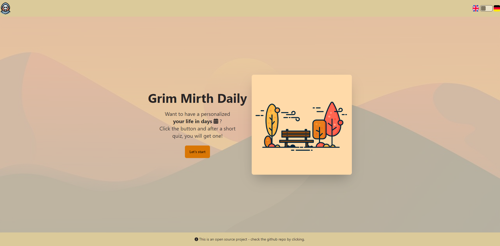
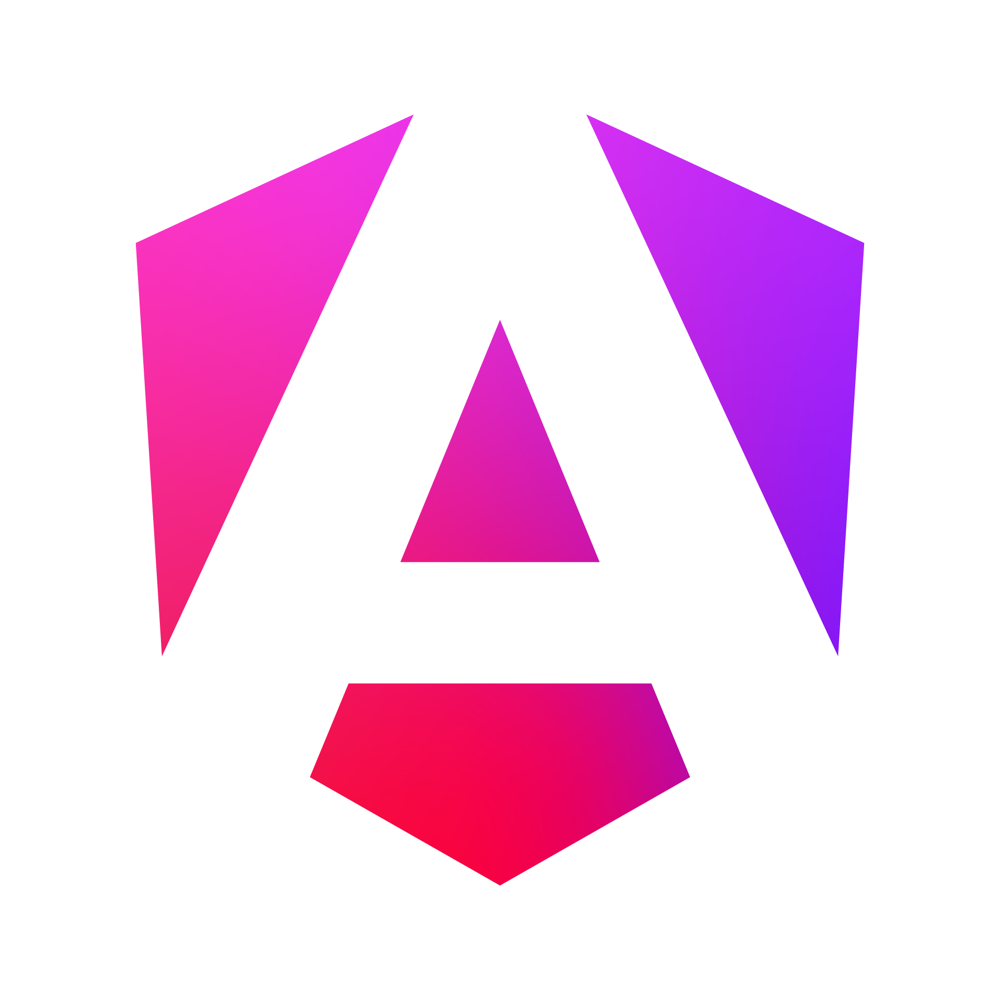
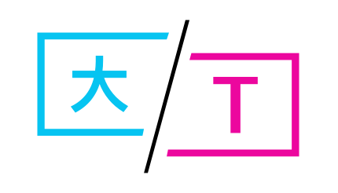

# Grim Mirth Daily
Ever wanted to have a calendar for every day in your life?  
Maybe you even got a printout one pinned to your wall?  
Time to level up with **Grim Mirth Daily**.  
With this WebApp you will be able to track each day of your life,  
get motivational quotes for every day, earn badges for achievements,  
set important days for an extra dose of motivation and much more to come!  
#SOON

# Roadmap
> [!NOTE]
> This is my personal project. I do not accept Pull Requests!  
> If you come across a bug, please feel free to create an issue and tag me in it - thank you :)

  
 
- [x] PoC: Technical setup (e. g. frontend &harr; backend communication)  
- [ ] V1: Standard QA dialog, standard calendar view, motivational pop up
- [ ] V2: Register+Login, Badges, Own avatar
- [ ] V3: TBD

# Used Technologies

  
  
  
  
  
  
   

